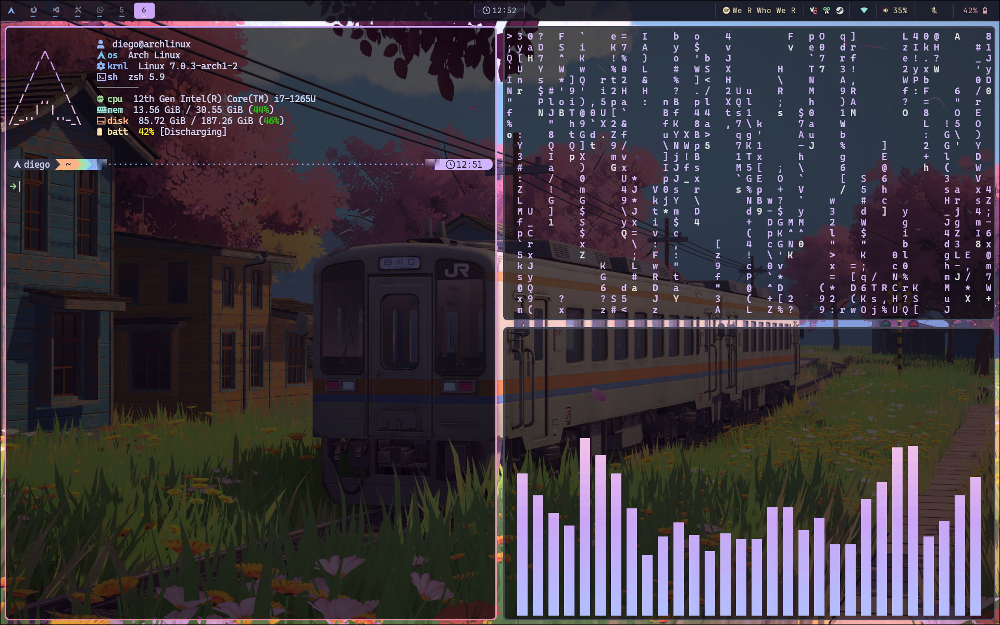
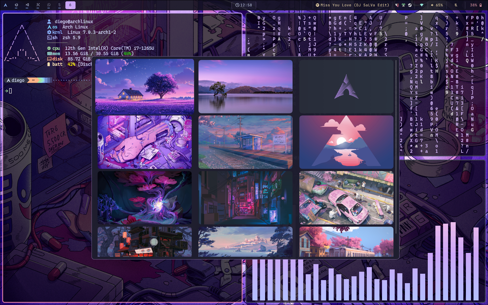

# DLH dotfiles

Configuracion personal para Hyprland, Waybar, Kitty, Zsh y herramientas de terminal.

## Screenshots

<p align="center">
    
</p>

<p align="center">
     
</p>

## Estructura

- `home/`: archivos que se enlazan directamente en `$HOME` con GNU Stow.
- `home/.config/`: configuraciones de aplicaciones.
- `home/scripts/`: scripts personales usados por el entorno.
- `install.sh`: instalador simple basado en Stow.

## Instalacion

```bash
git clone git@github.com:elDiego1415/DLH_dotfiles.git ~/dotfiles
cd ~/dotfiles
./install.sh
```

El instalador ejecuta:

```bash
stow -d ~/dotfiles -t ~ home
```

Si ya tienes archivos de configuracion en tu `$HOME`, Stow avisara del conflicto. Para adoptar esos archivos existentes dentro del repo y dejar enlaces simbolicos en su lugar, ejecuta:

```bash
./install.sh --adopt
```

Antes de adoptar puedes simular la operacion con:

```bash
stow -n -v --adopt -d ~/dotfiles -t ~ home
```

Una vez enlazado, editar `~/.config/waybar/config`, `~/.zshrc` o cualquier archivo gestionado modifica directamente el archivo correspondiente en `~/dotfiles/home`.

Para quitar los enlaces sin borrar los archivos del repo:

```bash
stow -D -d ~/dotfiles -t ~ home
```

## Incluye

- Shell: `.zshrc`, `.bashrc`, `.bash_profile`, `.gitconfig`
- Entorno grafico: `hypr`, `waybar`, `mako`, `wofi`, `gtk-3.0`, `xsettingsd`
- Terminal y CLI: `kitty`, `nvim`, `btop`, `fastfetch`, `yazi`, `lsd`, `lazygit`, `cava`
- Otros: `quickshell`, `waypaper`, `mpv`, scripts personales
